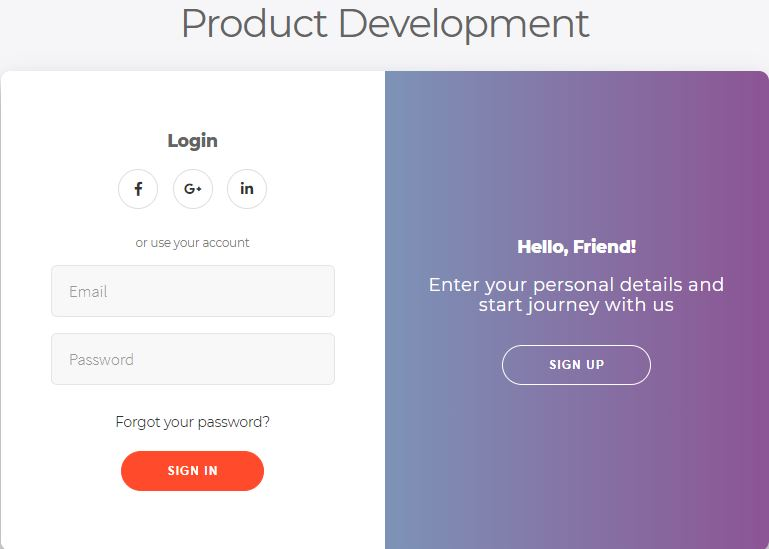
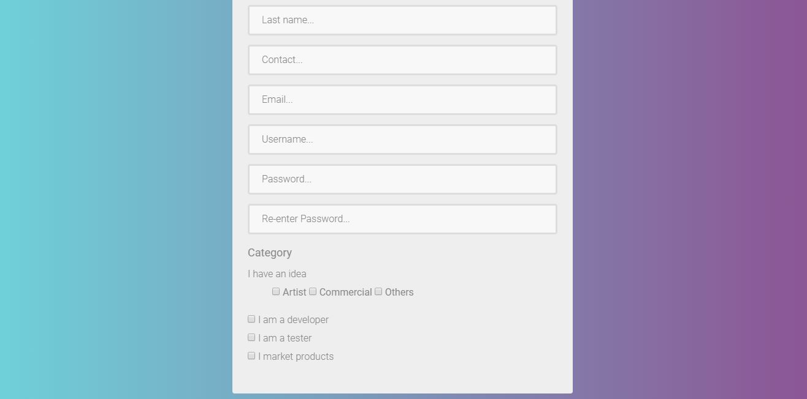

<div align="center">
    
    <br>
    <p><b>KJSCE Hackathon 2k19 </b></p>
</div>

## Team name : *Team GBMLR* :sunglasses:

  - [Need of the Project](#Need-for-the-project-(Why?))
  - [About the idea (How?)](#About-the-idea-(How?))
  - [Scope of project](#Scope-of-project)
  - [Login page](#Login-page)
  - [Register page](#Register-page)
  - [User Dashboard](#User-Dashboard)
  - [Product Dashboard](Product-Dashboard)
  - [Chat room](Chat-room)
  - [Teck stack](Tech-stack)
  - [Clone git repository](#clone-git-repository)
  - [License](#License)
  - [Contributors](#Contributors)


## Need for the project (Why?)

* Currently, people from different fields such as ideators, developers, testers & marketing people are hard to find under one roof.
* Our primary objective is to bring the above mentioned type of people together under one common environment and hence reduce the hassle of finding them.
* Currently, no such platform exists and hence      it is our endeavour to create a         multi-functionality collaborative environment.

## About the idea (How?)

1. Ideator posts a idea
2. Developer is interested in the proposed idea
3. Ideator approves developer
4. Developer applies for the project idea
5. Ideator-Developer Collaboration starts
6. Invite other developers & testers
7. Tester gives clearance  
8. Project proceeds to deployment
9. Marketing/ Investors
10. Deployed in the market              


## Scope of project

* This project would help the ideators to turn their dream ideas into reality faster.

* A well formed network of ideators, developers, testers and marketers would be established and would hence help bridge the gap that currently exists.

* Would provide a very good opportunity for freelancers to take up short term projects and would also help students to test their practical concepts by working on a real-life project.


## Login page

<div align="center">

<br>
<br>
</div>

## Register page

<div align="center">


<br>
<br>
</div>


## User Dashboard

<div align="center">


<br>
<br>
</div>


## Product Dashboard

<div align="center">


<br>
<br>
</div>


## Chat room

<div align="center">


<br>
<br>
</div>

<br>

* [Client Dashboard](https://github.com/pratik6725/client-dashboard "client")

* [Developer Dashboard](https://github.com/pratik6725/developer-dashboard "developer")

* [Backend HTTP endpoints](https://github.com/vedangparasnis/firebase-backend- "backend")

* [Project idea presentation](https://docs.google.com/presentation/d/18imMPc99OnRY0K84HY592O7hqkBqkJ2beVTVmu2EtpI/edit?usp=sharing "KJSCE HACK - TEAM GBMLR PPT")


## Tech stack

* [x] HTML5
* [x] CSS3
* [x] Javascript
* [x] jquery
* [x] Boostrap
* [x] Firebase
* [x] Soket .io
* [x] node.js
* [x] Express.js

## **Clone git repository**

```sh
Git clone "[https://github.com/TEAM-GBMLR/KJSCE-HACK](https://github.com/TEAM-GBMLR/KJSCE-HACK)"
```

## License

[MIT License](LICENSE) 


## Contributors

| Name            | Email :e-mail:              |
| --------------- | --------------------------- |
| Vedang parasnis | vedang.parasnis@somaiya.edu |
| Priya mane      | priya.hm@somaiya.edu        |
| Pratik merchant | pratik.merchant@somaiya.edu |
| Hritik Jaiswal  | hritik.jaiswal@somaiya.edu  |


<h3 align="center"><b>Developed with :heart: by <a href="https://github.com/vedangparasnis">Vedang Parasnis </a> , <a href="https://github.com/pugnator-12"> Priya Mane</a> , <a href="https://github.com/pratik6725">Pratik Merchant</a> and <a href="https://github.com/hritik5102">Hritik Jaiswal</a>.</b></h1>

